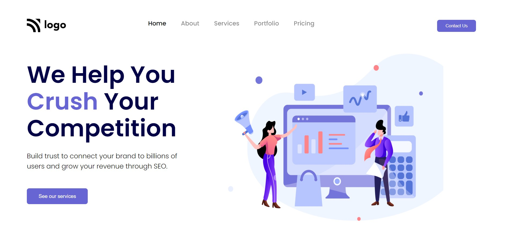

# Assignment 4

 

---

## Project 4 [Live link]()
- Skills Gained in this project
    - Learned css postions
    - Learned styling specific word of paragraph or heading
    
---

## Time taken to finish this project

- 02 hour taken to Finish this project.

Screenshot

